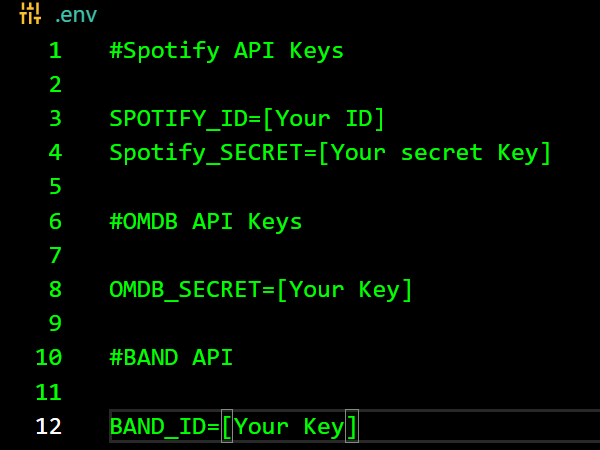
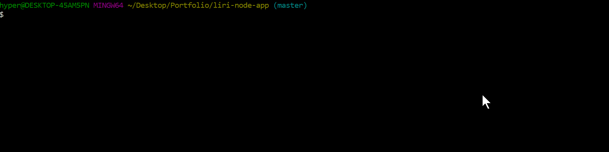
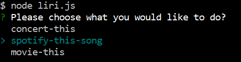
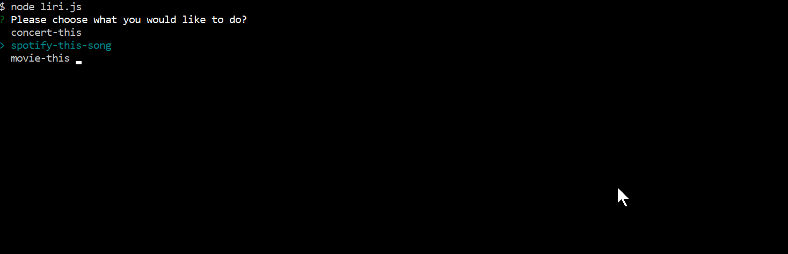
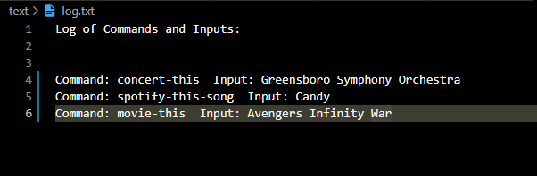
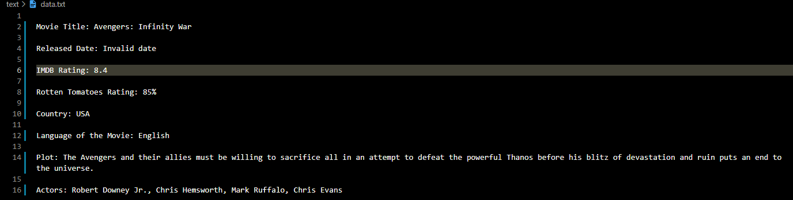

## liri-node-app

# Language Interpretation and Recognition Interface 

    LIRI is a Language Interpretation and Recognition Interface.
     LIRI will be a command line node app that 
     takes in parameters and gives you back data.

# Goal

    Looking for a concert? Maybe need info on a track/song,
    or just need to get details on a movie.
    Just type it in and search for it after choosing the right command. 

# Technologies/Framework

## Powered by Node.js

###  Npm Packeges:
        * axios
        * dotenv
        * inquirer
        * moment
        * node-spotify-api
  
# Installation

  * First make sure you install node dependencies by running npm install.

  * You will need to get API tokens from Spotify Developers API,
    Bands in Town Artist Events API, and OMDB API.

  * Please start with creating dot.env file at the root directory. Now pass in
    your credentials in the designated fields.

  

# Usage

  * Start by running: node liri.js

   

  * Now choose a command by using your arrow keys and selecting your desired command by pressing enter.

   

  * After choosing the command follow the prompt by entering your search keyword.

  * Here is an example of using the Spotify command to look up this track details and info.

   

### LOG/Data
 
  * You can find the log and data .txt file in the text folder.

  * The app also has a log file which will keep a history of the command chosen and search input.
    
     
 
  * Data logged to the console after the search will also be passed to the data.txt file 
    keeping the last copy of the data you received. Everytime you create a search it will overwrite the 
    file. 

     

# Credits

  Credit goes out to Trilogy Education and their Coding BootCamp at UNC. The idea to create such app pushed 
  my skills to grow and learn new technologies to accomplish my end goal.  

# My GitHub

  [https://github.com/Eddie-Reta](https://github.com/Eddie-Reta)

# License 

  MIT :copyright: **Eduardo Reta Jr.**